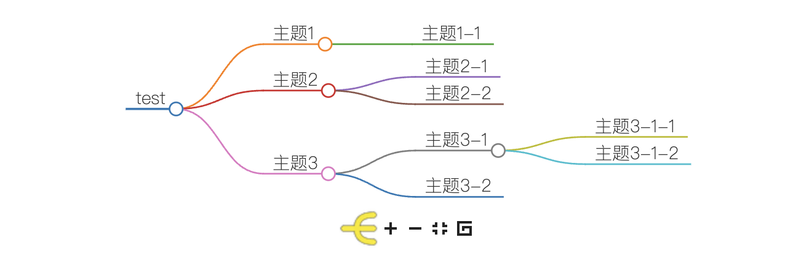

# EasyMindMap
## Introduction
Obsidian插件，集成Markmap到obsidian，现在你可以通过在Obsidian文档中通过代码块的方式使用markdown的语法创建思维导图

## Download
当前该插件仅发布了第一个版本 0.0.2, 因为在执行Actions时，第一个0.0.1的版本不知道什么原因失败了，但是我没有找到github如何手动为一个tag执行workflow，所以它的第一个版本不是 0.0.1

插件并没有上架Obsidian的官方社区，所以你没有办法直接在Commutity Plugins模块中找到`EasyMindMap`, 如果你想在自己文档中随时随地插入一副思维导图，可以下载该插件试一试，具体插件的安装方法：
- 第一步, 下载插件所需要的文件 [easy-mind-map-0.0.2](https://github.com/sangzihao/easy-mind-map/releases/download/0.0.2/easy-mind-map-0.0.2.zip)
- 第二步, 将你下载的文件进行解压，你会看到三个文件：`main.js`,`style.css`,`manifest.json` 将你解压缩后的文件夹移动到`path/to/.obsidian/plugins`目录中，然后重启你的Obsidian，你就可以在`Preferences > Communtity plugins > Installed plugins`中找到它，然后开启该插件就可以开始尝试编写你的思维导图了。

## Usage
插件的用法非常的简单，在你的Obsidian文档中创建一个名称为`mindmap`的代码块，然后按照Markmap的语法编写你的思维导图即可。
markmap的用法：[markmap home](https://markmap.js.org)
```mindmap
---
title: test
---
# 主题1
## 主题1-1
# 主题2
## 主题2-1
## 主题2-2
# 主题3
## 主题3-1
- 主题3-1-1
- 主题3-1-2
## 主题3-2
```
最终上面的代码块将被渲染成：


markmap也支持在文档头部为你的思维导图定制一些配置，更多有用的用法见 [try it out](https://markmap.js.org/repl)
## Future
当前插件的功能完全基于Markmap这个开源工具，如果你对它的原理感兴趣，可以去它的官网详细了解。虽然Obsidian插件可以实现非常灵活的后处理能力，但是我的初衷非常简单，就是想在文档中插入一个思维导图，而不需要我先在其他专业的思维导图软件中画好，然后导出为图片，再插入到Obsidian
未来可能的改进方向：
- 适配思维导图的显示大小
- 支持将思维导图到处为图片
- 思维导图中代码块显示问题，因为我发现Obsidian文档中不能嵌套代码块，这个可能需要做一些特殊的后处理

## Contact
如果你有更好的想法，直接在该插件下进行留言即可